# Thrusty heating pipeline — inputs → calculation → output

How a reentry-vehicle definition becomes a heating verdict. **● = implemented today**
(`heating.py` / `trajectory.py`); **○ = designed in `HEATING_MODEL_CROSSCHECK.md` §10**, not yet coded.

```mermaid
flowchart LR
  subgraph IN["1 · USER INPUTS"]
    direction TB
    I1["● nose_radius_m<br/>(or geometry → effective_nose_radius_m)"]
    I2["● tps_material<br/>aluminum … carbon_ablator"]
    I3["● emissivity ε (0.85)"]
    I4["● mass_kg · β · frontal_area"]
    I5["● glider_enabled · glider_LD · guidance<br/>· pull-up g · terminal dive"]
    I6["● launch / trajectory:<br/>velocity · flight-path angle · range"]
    I7["○ nose_shape + b/a · per-location nose / body<br/>materials · body_tps_thickness · nose_solid_depth<br/>· structure_material / limit · soak_dwell · AoA"]:::d
  end

  subgraph CALC["2 · THRUSTY CALCULATES (trajectory.py)"]
    direction TB
    C1["● 6-DOF / glide trajectory<br/>→ state history: t · ρ(alt) · V · alt · range"]
    C2["● effective_nose_radius_m() → R_n<br/>○ shape-aware R_eff"]
    C3["● glide-regime verdict<br/>skip / capture / plunge"]
  end

  subgraph HEAT["3 · HEATING CALCULATIONS (heating.py)"]
    direction TB
    H1["● Stagnation flux — Sutton-Graves<br/>q̇ = 1.7415e-4 · √(ρ/R_n) · V³"]
    H2["● Wall temp — radiative equilibrium<br/>T_eq = (q̇ / εσ)^¼"]
    H3["● Integrated load  Q = ∫ q̇ dt"]
    H4["● Peak flux  q_peak · peak T_eq"]
    H5["● Crit 1 peak_surface: T_peak / peak_K"]
    H6["● Crit 2 soak: dwell above continuous_K"]
    H7["● Crit 3 heat_sink: Q vs Q_melt (re-rad cap)"]
    H8["● Earliest compromise point + verdict"]
    H9["● Benchmark match (q, Q)"]
    HA["○ Hot-wall T_w (energy balance, not cold-wall)<br/>· Recession δ = Q/(ρ·H_eff) → δ/R_n bands<br/>· Laminar/turbulent TRANSITION bracket<br/>· Per-location nose / LE / acreage + bondline check<br/>· Accuracy-erosion flag (shape→drag→dispersion)<br/>· CO₂/Mars SG constant 1.83e-4"]:::d
  end

  subgraph OUT["4 · COMMUNICATED TO USER"]
    direction TB
    O1["● result['heating_fom']:<br/>q_peak_MW_m2 · T_eq_peak_K ·<br/>integrated_load_MJ_m2 · benchmark(s)"]
    O2["● criteria{} — per-criterion margins"]
    O3["● verdict string<br/>COMPROMISED@t / no failure /<br/>set material / outside validity"]
    O4["● compromise{} + trajectory row event<br/>'TPS compromise — {mode}'"]
    O5["● warnings[] — screening-model caveats"]
    O6["○ survival band + accuracy band ·<br/>laminar/turbulent bracket · recession δ/R_n ·<br/>material dropdown · likely/possible/plausible"]:::d
  end

  I1 & I2 & I3 & I4 --> HEAT
  I5 & I6 --> CALC
  I7 -.-> CALC
  I7 -.-> HEAT
  CALC -- "state history + R_n" --> HEAT
  HEAT --> OUT
  classDef d fill:#fff3cd,stroke:#b8860b,stroke-dasharray:5 4,color:#000;
```

---

## 1 · What the user inputs

**Required / Optional** column: **Req** = no usable result without it · **Opt(default)** = has a
sensible default, override is an expert knob · **Derived** = computed from other inputs if not given.

| Input | Field / source | Required? | Role | Status |
|---|---|---|---|---|
| Nose radius | `RVParams.nose_radius_m` (default 0.0) → else `effective_nose_radius_m()` from geometry | **Derived** — needs geometry *or* explicit value | sets stagnation flux (`q̇ ∝ 1/√R_n`) | ● |
| TPS material | `RVParams.tps_material` (default `""`) → `TPS_MATERIALS` key | **Req for a verdict** — empty ⇒ physical numbers only | sets the temperature/load limits | ● |
| Emissivity | `RVParams.emissivity` (**default 0.85**, Anderson §18.8 / Hirschel; typical TPS range **0.75–0.90**, NASA RP-1289 RCC) | **Opt(default)** | sets radiative-equilibrium wall temp | ● |
| Mass / β | `mass_kg`, `beta_kg_m2` (no default) | **Req** | heat-sink criterion; drives trajectory | ● |
| Frontal area | frontal area | **Derived** (from geometry/β) | heat-sink criterion | ● |
| Glider params | `glider_enabled` (default `False`), `glider_LD`, `glider_guidance` (default `equilibrium_glide`), pull-up g, terminal dive | **Opt(default)** — off ⇒ ballistic | selects ballistic vs glide trajectory (→ load) | ● |
| Launch / trajectory | velocity, flight-path angle, range | **Req** | generates the state history | ● |
| Nose shape | `nose_shape` (default `spherical`) + `b/a` / flat-face / biconic | **Opt(default)** | shape-aware `R_eff` → flux & recession (§10.5) | ○ |
| Per-location materials | `nose_tps_material`, `body_tps_material` + `body_tps_thickness_m`, `nose_solid_depth_m` | **Opt(default)** — fall back to single `tps_material`; depth derived from geometry | nose/LE/acreage resolved separately (§10.1/10.4) | ○ |
| Structure / bondline | `structure_material`, `structure_limit_K` | **Opt(default)** — off, or auto from material (~120 °C metal / ~250–260 °C ablative) | binding limit is often the junction, not surface (§10.7) | ○ |
| Soak dwell | `soak_dwell_s` (**default 120 s**) | **Opt(default)** | soak criterion threshold | ● |
| Angle of attack | trim AoA | **Opt(default)** — 0 ⇒ symmetric | AoA → dispersion & windside overheat (§10.6/10.7) | ○ |

**Bottom line — only three things are truly required:** a **nose radius** (explicit or from geometry),
a **TPS material** (for a verdict, not just numbers), and **mass + β + a trajectory**. Everything else
(emissivity, glider mode, nose shape, per-location/bondline fields, soak dwell, AoA) has a working
default — the user touches them only to refine the screening.

## 2 · What Thrusty calculates (before heating)

| Calculation | Where | Output | Status |
|---|---|---|---|
| Trajectory (6-DOF / analytic glide) | `trajectory.py` | state history `t, ρ(alt), V, alt, range` — the only thing that differs between ballistic & glide | ● |
| Effective nose radius | `effective_nose_radius_m()` | `R_n` for the flux term | ● |
| Shape-aware `R_eff` | (designed) | spherical `R_n` / oblate `b²/a` / flat-face ~2·R_n / biconic ~1.2–1.3 | ○ |
| Glide-regime verdict | `glide_regime.py` | skip / capture / plunge (context for the heating arc) | ● |

## 3 · Which heating calculations Thrusty does

| # | Calculation | Formula / basis | Status |
|---|---|---|---|
| 1 | Stagnation convective flux | Sutton-Graves `q̇ = 1.7415e-4·√(ρ/R_n)·V³` (Earth air SI) | ● |
| 2 | Wall temperature | radiative equilibrium `T_eq = (q̇/εσ)^¼` | ● |
| 3 | Integrated load | `Q = ∫ q̇ dt` (trapezoid over the arc) — the glide "stopwatch" | ● |
| 4 | Peak flux & peak wall temp | max over the arc | ● |
| 5 | Criterion — peak surface | `T_peak / peak_K` (melt/ablation onset) | ● |
| 6 | Criterion — soak | dwell time above `continuous_K` vs `soak_dwell_s` | ● |
| 7 | Criterion — heat sink | `Q` vs `Q_melt`, net of the re-radiation cap `εσ·continuous_K⁴` | ● |
| 8 | Earliest compromise + verdict | first criterion to fail, with time | ● |
| 9 | Benchmark match | nearest known flux/load anchor | ● |
| — | Hot-wall `T_w` (energy balance, not cold-wall) | concern #1 fix (§3) | ○ |
| — | Recession `δ = Q/(ρ·H_eff)` → `δ/R_n` bands | B′ ablation; ~0.1 onset / 0.5–1 blunting / burn-through (§10.2) | ○ |
| — | Laminar/turbulent **transition bracket** | irreducible band, not a point estimate (§4) | ○ |
| — | Per-location (nose / LE / acreage) + bondline | `T_wr ∝ x^(−1/4)` falloff; check the junction (§10.7) | ○ |
| — | Accuracy-erosion flag | shape→drag→dispersion when λ high / p>55 atm / AoA≠0 (§10.6) | ○ |
| — | CO₂/Mars SG constant | `1.83e-4` for Mars entries (§9) | ○ |

## 4 · How results are communicated

| Output | Vehicle | Content | Status |
|---|---|---|---|
| `result['heating_fom']` dict | return value | `q_peak_MW_m2`, `T_eq_peak_K`, `integrated_load_MJ_m2`, `benchmark`, `benchmark_load`, `material` | ● |
| `criteria{}` | inside the dict | per-criterion `margin` + `limit_K` (peak_surface / soak / heat_sink) | ● |
| `verdict` | string | `COMPROMISED — {mode} at t=…` · `no screened thermal failure` · `set the RV's tps_material` · `outside no-ablation model validity` | ● |
| `compromise{}` + trajectory event | dict + trajectory row | earliest failure mode/time, surfaced as a flight-arc event `"TPS compromise — {mode}"` | ● |
| `warnings[]` | list | screening-model caveats (stagnation-only, no ablation/backface, convective-only >9 km/s, …) | ● |
| Survival **band** + accuracy band | (designed) | laminar/turbulent bracket, recession `δ/R_n`, material dropdown, **likely / possible / plausible** wording (§5) | ○ |
